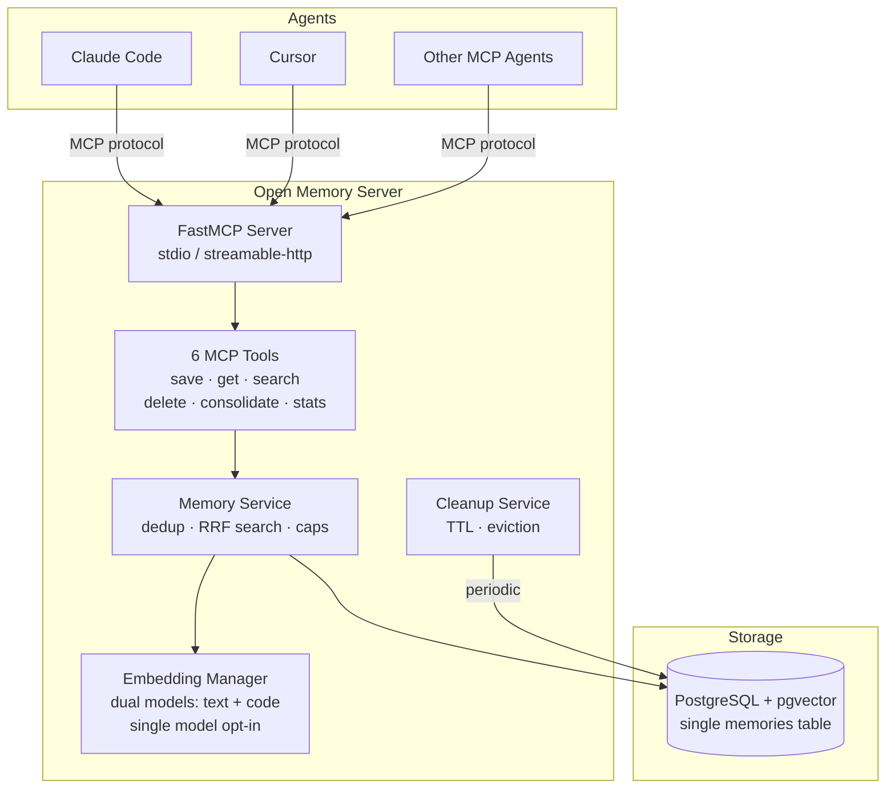
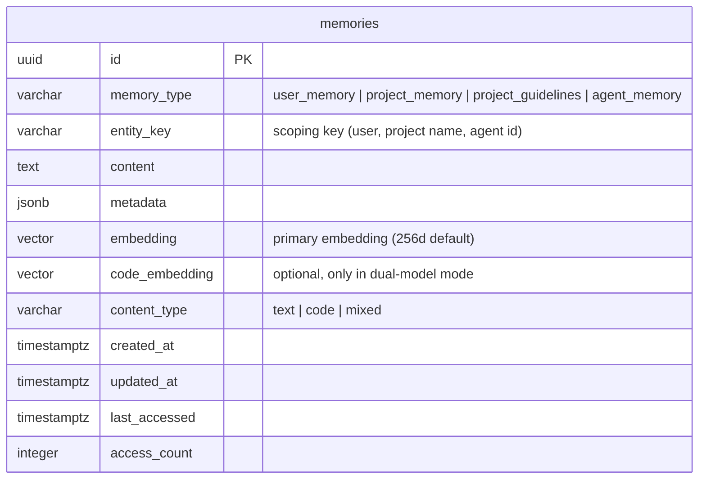
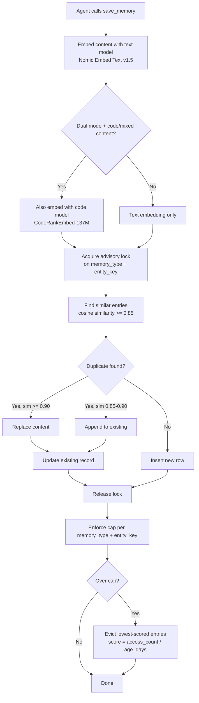
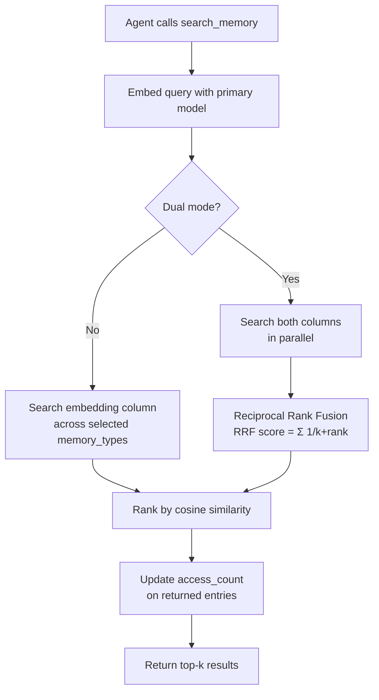
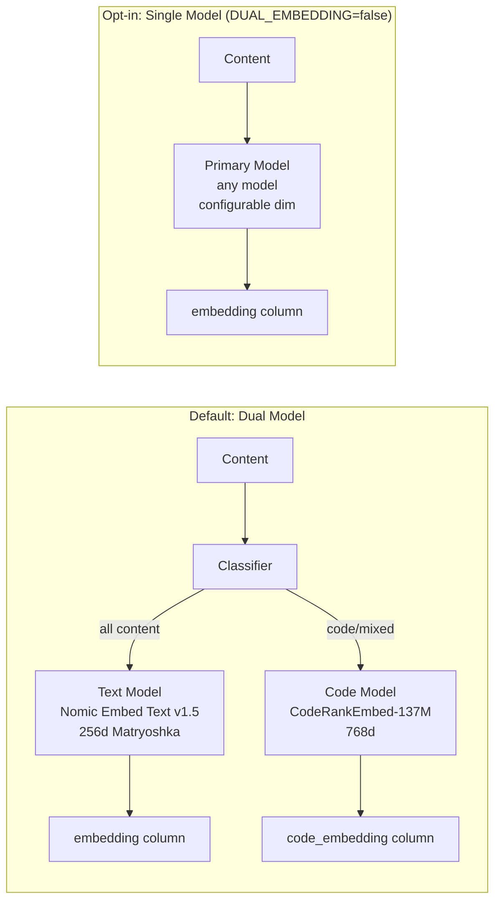
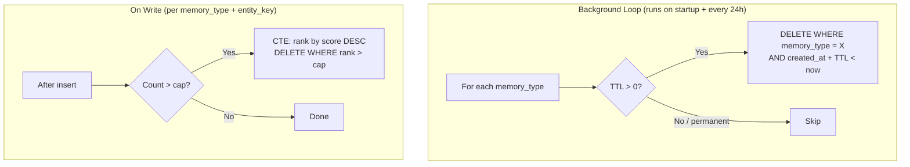
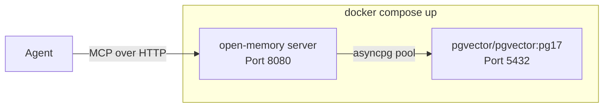
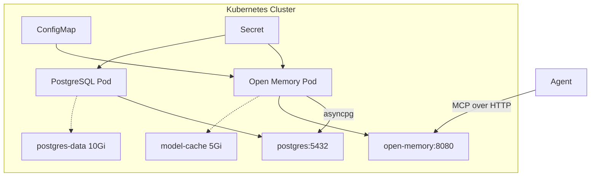

# Architecture

## System Overview

## Database Schema

Single table design with `memory_type` discriminator:

**Indexes:**
- `(memory_type, entity_key)` — B-tree composite for filtered lookups
- `embedding` — HNSW with `vector_cosine_ops` for semantic search
- `code_embedding` — HNSW (only created when `DUAL_EMBEDDING=true`)
- `last_accessed` — B-tree for cleanup ordering

## Write Flow (Dedup-on-Write)

## Search Flow

## Embedding Architecture

**Why dual model by default:** Coding agent memory is inherently mixed — natural language preferences alongside code patterns. Nomic Embed Text v1.5 excels at text, CodeRankEmbed-137M excels at code. The primary model always embeds everything (so search always works), while the code model adds a second embedding for code-heavy content to improve code-specific retrieval. Combined ~500MB, both run on CPU.

## Cleanup and Eviction

## Deployment

### Docker Compose

### Kubernetes

## Configurable Models

| Variable | Default | Purpose |
|----------|---------|---------|
| `EMBEDDING_MODEL` | `nomic-ai/nomic-embed-text-v1.5` | HuggingFace model for text embeddings |
| `EMBEDDING_DIM` | `256` | Output dimension (Matryoshka truncation) |
| `DUAL_EMBEDDING` | `true` | Dual text+code model mode (disable for single model) |
| `CODE_EMBEDDING_MODEL` | `nomic-ai/CodeRankEmbed` | Code model (only when dual=true) |
| `CODE_EMBEDDING_DIM` | `768` | Code embedding dimension |
| `ENABLE_GPU` | `false` | Route inference to CUDA |

> **Note:** Changing the embedding model or dimension after data exists will make existing embeddings incompatible. Re-embed or start fresh.
